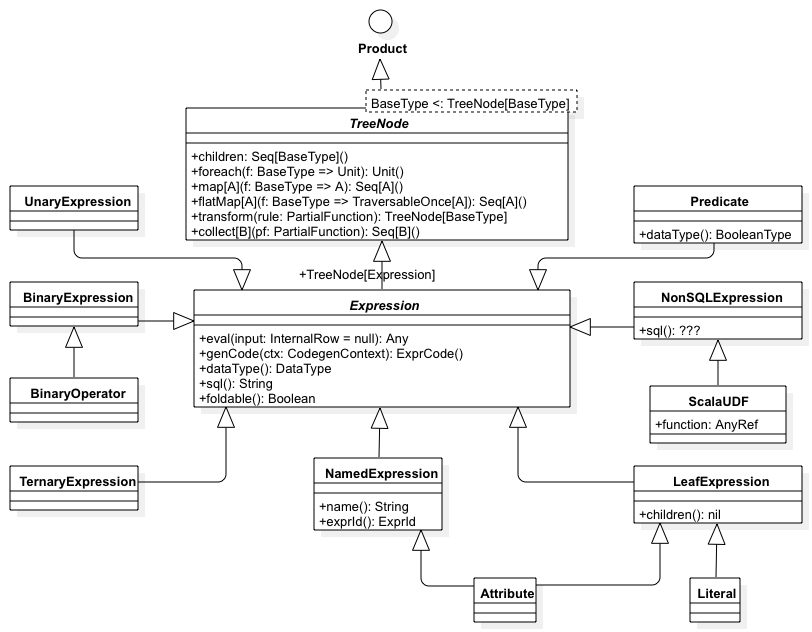
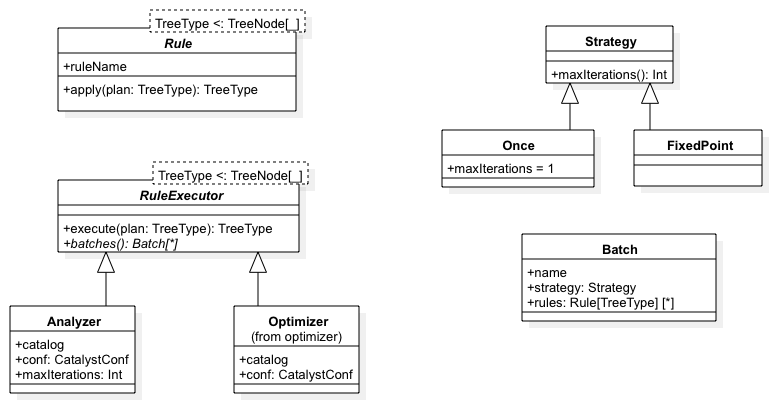
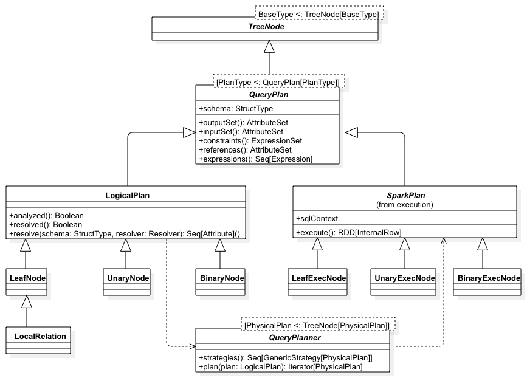

# Spark Catalyst Study


1. [Introduction](#introduction)
2. [Catalyst basic types, structures and hierarchies](#catalyst-basic-types-structures-and-hierarchies)
    * [TreeNode](#treenode)
    * [Expressions](#expressions)
    * [Rules](#rules)
    * [Plans](#plans)
3. [Catalyst workflow](#catalyst-workflow)
    * [Creating logical plans](#creating-logical-plans)
    * [Analyzing the logical plans](#analyzing-the-logical-plans)
    * [Optimizing the logical plans](#optimizing-the-logical-plans)
    * [Transforming a logical plan into a physical plan](#transforming-a-logical-plan-into-a-physical-plan)
    * [Choosing a Spark physical plan](#choosing-a-spark-physical-plan)
    * [Generating the code](#generating-the-code)
    * [Executing the Spark physical plan](#executing-the-spark-physical-plan)
    * [Using Catalyst to communicate computing to external systems](#using-catalyst-to-communicate-computing-to-external-systems) 


## Introduction

This project started as a research to find alternative ways of passing computation logic from Spark to external, 
independent systems (like Apache Flink).

The main idea is to be able to pass complicated input transformation and if possible the prediction transformations
done by the machine learning models in Spark.

The current status of the research: ***WIP*** (and not RIP).

The code available is raw, barely documented and far from being readable, but we might get there.
For better code structure and better explanations I suggest [anatomy-of-spark-catalyst](https://github.com/phatak-dev/anatomy-of-spark-catalyst).

Some slides from an initial presentation are available [here](docs/SparkCatalyst.pdf).


## Catalyst basic types, structures and hierarchies

### TreeNode

***TBD***

- TreeNode is the main data type in Catalyst.
- TreeNodes are immutable.
- TreeNodes can be manipulated through recursive functional transformations (e.g. map, flatMap, foreach, transform…).
- TreeNode has two main implementations: Expression and QueryPlan.

### Expressions

***TBD***



### Rules

***TBD***



### Plans

***TBD***



## Catalyst Workflow


### Creating logical plans

***TBD***

As the workflow diagram shows, there are two main methods to create a QueryPlan:

1. From a DataFrame / Dataset
2. By parsing a SQL text

#### Creating logical plans form a Dataset

```scala
type DataFrame = Dataset[Row]
```

"A Dataset is a strongly typed collection of domain-specific objects that can be transformed
in parallel using functional or relational operations. Each Dataset also has an untyped view
called a [[DataFrame]], which is a Dataset of [[Row]]."

"Datasets are "lazy", i.e. computations are only triggered when an action is invoked. Internally,
a Dataset represents a logical plan that describes the computation required to produce the data.
When an action is invoked, Spark's query optimizer optimizes the logical plan and generates a
physical plan for efficient execution in a parallel and distributed manner. To explore the
logical plan as well as optimized physical plan, use the `explain` function."

```scala
class Dataset[T] private[sql](
    @transient val sparkSession: SparkSession,
    @DeveloperApi @transient val queryExecution: QueryExecution,
    encoder: Encoder[T])
  extends Serializable {
  
  ...
    def this(sparkSession: SparkSession, logicalPlan: LogicalPlan, encoder: Encoder[T]) = {
      this(sparkSession, sparkSession.sessionState.executePlan(logicalPlan), encoder)
    }
  ...
```

We notice that the default constructor is private, but there is one public constructor that can be used.
If we have a look on how the Datasets are created we notice a few simple use cases is `SparkSession`:

```scala
...
  def emptyDataset[T: Encoder]: Dataset[T] = {
    val encoder = implicitly[Encoder[T]]
    new Dataset(self, LocalRelation(encoder.schema.toAttributes), encoder)
  }
...
  def createDataset[T : Encoder](data: Seq[T]): Dataset[T] = {
    val enc = encoderFor[T]
    val attributes = enc.schema.toAttributes
    val encoded = data.map(d => enc.toRow(d).copy())
    val plan = new LocalRelation(attributes, encoded)
    Dataset[T](self, plan)
  }
...
  def createDataset[T : Encoder](data: RDD[T]): Dataset[T] = {
    val enc = encoderFor[T]
    val attributes = enc.schema.toAttributes
    val encoded = data.map(d => enc.toRow(d))
    val plan = LogicalRDD(attributes, encoded)(self)
    Dataset[T](self, plan)
  }
```


```scala
class QueryExecution(val sparkSession: SparkSession, val logical: LogicalPlan) {
  ...
  lazy val analyzed: LogicalPlan = {
    SparkSession.setActiveSession(sparkSession)
    sparkSession.sessionState.analyzer.execute(logical)
  }
  ...
  lazy val optimizedPlan: LogicalPlan = sparkSession.sessionState.optimizer.execute(withCachedData)
  ...
  
  lazy val sparkPlan: SparkPlan = {
    SparkSession.setActiveSession(sparkSession)
    planner.plan(ReturnAnswer(optimizedPlan)).next()
  }
  ...
  
  // executedPlan should not be used to initialize any SparkPlan. It should be
  // only used for execution.
  lazy val executedPlan: SparkPlan = prepareForExecution(sparkPlan)

}
```


#### Creating logical plans by parsing a SQL query

***TBD***


### Analyzing the logical plans

***TBD***


### Optimizing the logical plans

***TBD***


### Transforming a logical plan into a physical plan

***Also known as "Let's get physical..."***

***TBD***


### Choosing a Spark physical plan

***TBD***


### Generating the code

***TBD***


### Executing the Spark physical plan

***TBD***


### Using Catalyst to communicate computing to external systems 

***TBD***


## References:
 
[Spark SQL: Relational Data Processing in Spark](http://people.csail.mit.edu/matei/papers/2015/sigmod_spark_sql.pdf)

[SPARK-1251 Catalyst](https://spark-project.atlassian.net/browse/SPARK-1251)

[SPARK-12795 Whole stage codegen](https://issues.apache.org/jira/browse/SPARK-12795)

[Deep Dive into Spark SQL’s Catalyst Optimizer](https://databricks.com/blog/2015/04/13/deep-dive-into-spark-sqls-catalyst-optimizer.html)

[Apache Spark as a Compiler](https://databricks.com/blog/2016/05/23/apache-spark-as-a-compiler-joining-a-billion-rows-per-second-on-a-laptop.html)
 
[anatomy-of-spark-catalyst](https://github.com/phatak-dev/anatomy-of-spark-catalyst)
